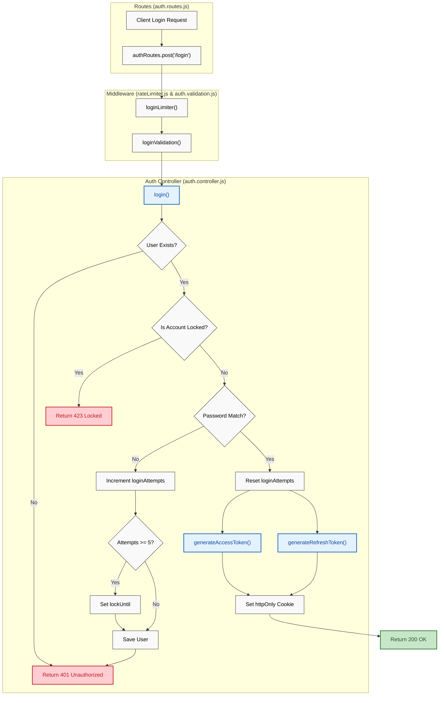

## 1. High-Level Summary (TL;DR)
*   **Impact:** **High** - Introduces a robust, secure authentication system, specifically focusing on the `login` flow, session management via cookies, and brute-force protection.
*   **Key Changes:**
    *   ✨ **Secure Login Controller:** Added complete login logic with JWT generation (Access & Refresh tokens) and `httpOnly` cookie configuration.
    *   🛡️ **Account Lockout Mechanism:** Updated the User model to track failed login attempts and lock accounts temporarily to prevent credential stuffing.
    *   ♻️ **Refactored Middleware:** Extracted validation (`express-validator`) and rate limiting (`express-rate-limit`) logic into dedicated modular files (`auth.validation.js` & `rateLimiter.js`).
    *   🍪 **Cookie Parsing:** Integrated `cookie-parser` into the main Express app to support secure token transmission.
    *   🧪 **Comprehensive Testing:** Added unit and integration tests covering the login flow, validation edge cases, and rate limiters.

## 2. Visual Overview (Code & Logic Map)

## 3. Detailed Change Analysis

### 🔐 Authentication Controller (`auth.controller.js`)
*   **What Changed:** Implemented the `login` function. It now validates credentials, checks if the account is active/verified, and verifies the password using `bcrypt.compare`.
*   **Account Lockout:** Added logic to track failed attempts. If a user fails 5 times, their account is locked for 15 minutes.
*   **Token Generation:** Created `generateAccessToken` (15m expiry) and `generateRefreshToken` (7d expiry) using `jsonwebtoken`. Tokens are returned via secure `httpOnly` cookies to prevent XSS attacks.

### 🗄️ Database Schema (`user.model.js`)
*   **What Changed:** Added fields to support the new account lockout security feature.

| Field | Type | Required | Default | Description |
| :--- | :--- | :--- | :--- | :--- |
| `loginAttempts` | `Number` | Yes | `0` | Tracks the number of consecutive failed login attempts. |
| `lockUntil` | `Number` | No | `undefined` | Timestamp (ms) indicating when the temporary lockout expires. |

### 🛣️ Routes & Middleware
*   **What Changed:** Cleaned up `auth.routes.js` by extracting inline rate-limiting and validation logic. Added new endpoints for the complete auth lifecycle.

| Endpoint | Method | Middleware Added | Controller Method |
| :--- | :--- | :--- | :--- |
| `/api/auth/login` | `POST` | `loginLimiter`, `loginValidation` | `login` |
| `/api/auth/logout` | `POST` | None (in diff) | `logout` |
| `/api/auth/refresh-token` | `POST` | None (in diff) | `refreshToken` |

### 🛠️ Utilities & Configuration
*   **Validation (`auth.validation.js`):** Extracted `signupValidation` and created a new `loginValidation` array using `express-validator`.
*   **Rate Limiting (`rateLimiter.js`):** Created modular limiters: `signupLimiter` (10/15m), `loginLimiter` (5/15m), and a generic `apiLimiter`.
*   **App Config (`app.js`):** Added `cookie-parser` to process incoming cookies containing JWTs.

## 4. Impact & Risk Assessment

*   ⚠️ **Breaking Changes:** The `signup` route no longer defines its validation and rate-limiting inline. If any external modules were incorrectly relying on the old file structure, they will break (though unlikely for route files).
*   🛡️ **Security Enhancements:** 
    *   **Brute Force Protection:** Mitigated via strict IP-based rate limiting and Account-based lockouts.
    *   **XSS Mitigation:** Using `httpOnly` cookies prevents JavaScript access to sensitive tokens.
*   🧪 **Testing Suggestions:**
    *   Verify that the `REFRESH_TOKEN_SECRET` and `ACCESS_TOKEN_SECRET` environment variables are properly provisioned in production.
    *   Test the `logout` and `refresh-token` controllers (referenced in routes but not fully visible in this diff) to ensure they properly clear cookies and rotate tokens.
    *   Verify cross-origin resource sharing (CORS) settings to ensure cookies are sent correctly from the frontend client.